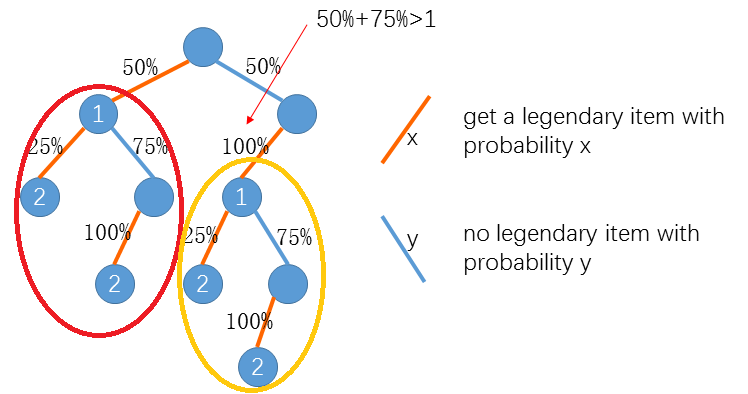
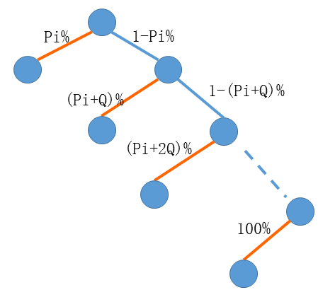

### 微软2017年预科生计划在线编程笔试题目题解

___友情提示，题目解析在最后___

Legendary Items
=====

Description
----
Little Hi is playing a video game. Each time he accomplishes a quest in the game, Little Hi has a chance to get a legendary item.

At the beginning the probability is P%. Each time Little Hi accomplishes a quest without getting a legendary item, the probability will go up Q%. Since the probability is getting higher he will get a legendary item eventually.

After getting a legendary item the probability will be reset to ⌊P/(2^I)⌋% (⌊x⌋ represents the largest integer no more than x) where I is the number of legendary items he already has. The probability will also go up Q% each time Little Hi accomplishes a quest until he gets another legendary item.

Now Little Hi wants to know the expected number of quests he has to accomplish to get N legendary items.

Assume P = 50, Q = 75 and N = 2, as the below figure shows the expected number of quests is


```2*50%*25% + 3*50%*75%*100% + 3*50%*100%*25% + 4*50%*100%*75%*100% = 3.25```

Input
----
The first line contains three integers P, Q and N.

1<=N<=10^6, 0<=P<=100, 1<=Q<=100

Output
----

Output the expected number of quests rounded to 2 decimal places.

Sample Input
-----

50 75 2

Sample Output
----

3.25


Tree Restoration
======

Description
-----

There is a tree of N nodes which are numbered from 1 to N. Unfortunately, its edges are missing so we don't know how the nodes are connected. Instead we know:

1. Which nodes are leaves
2. The distance (number of edges) between any pair of leaves
3. The depth of every node (the root's depth is 1)
4. For the nodes on the same level, their order from left to right

Can you restore the tree's edges with these information? Note if node u is on the left of node v, u's parent should not be on the right of v's parent.


Input
----
The first line contains three integers N, M and K. N is the number of nodes. M is the depth of the tree. K is the number of leaves.  
The second line contains M integers A1, A2, ... AM. Ai represents the number of nodes of depth i.  
Then M lines follow. The ith of the M lines contains Ai numbers which are the nodes of depth i from left to right.  
The (M+3)-th line contains K numbers L1, L2, ... LK, indicating the leaves.  
Then a K x K matrix D follows. Dij represents the distance between Li and Lj.  

1 <= N <= 100

Output
----
For every node from 1 to N output its parent. Output 0 for the root's parent.

Sample Input
-----
8 3 5  
1 3 4  
1  
2 3 4  
5 6 7 8  
3 5 6 7 8  
0 3 3 3 3  
3 0 2 4 4  
3 2 0 4 4  
3 4 4 0 2  
3 4 4 2 0  

Sample Output
-----
0 1 1 1 2 2 4 4


Maze Escape
=====

Description
----

In a video game Little Hi is trapped in a maze. The maze can be considered as an N x M grid. There are monsters on some cells. Each cell has one monster at most. Below is an example of a 4x5 maze. '.' represents an empty cell. 'D' represents the entrance, Little Hi's starting point. 'M' represents a normal monster. 'S' represents a special monster.

```
..S..
M...M
..D..
.M...
```

At the beginning, each cell is covered by a slate except that the slate on the entrance cell has been already removed. Each round Little Hi may either remove a slate as long as

1. each monster has either been killed or still covered by a slate, and
2. the cell covered by the slate is adjacent to some cell whose slate has been already removed. (Two cells are adjacent if they share a common side.)

or attack a monster as long as the slate covering it has been removed.

At the beginning Little Hi has Hp hit points and Ap attack points. Each monster also has its hit points Hi and attack points Ai. When Little Hi attacks a monster, the hit points of both sides should subtract the attack points of the other side.

For example, if Little Hi's hit points are 50 and attack points are 30. When he attacks a monster whose hit points are 25 and attack points are 10, the remaining hit points for Little Hi are 40 and the remaining hit points for the monster are -5.

When hit points are less than or equal to 0 the monster is killed.

At the beginning Little Hi has a buff called "Destruction Blade" which lasts for 5 rounds. With such buff Little Hi does not take damage when he attacks a monster. The buff vanishes after 5 rounds but can be refreshed or regained for the following 5 rounds after killing a special monster. (Note that the buff always lasts for 5 rounds after killing a special monster no matter how many rounds left before killing the monster.)

Now given the map of the maze. Can you tell whether Little Hi can kill all the monsters? If he can what is the maximum remaining hit points?

Input
----
Line 1: two integers N and M. (2 <= N, M <= 6, N x M <= 20)
Line 2 .. N+1: M characters per line, representing the maze map.
Line N+2 .. N+K+1: two integers Hi and Ai per line, representing the hit points and attack points for each monster, from top to bottom and left to right. (3 <= K <= 7)
Line N+K+2: two integers Hp and Ap, the hit points and attack points for Little Hi.

Output
----
If Little Hi can kill all the monsters and stay alive output the maximum remaining hit points. Otherwise output DEAD.

Sample Input
----
4 5  
..S..  
M...M  
..D..  
.M...  
20 5  
20 5  
20 5  
20 5  
60 10  

Sample Output
----
45

Sample Explaination
-----
Let's assume the upper left cell is (1, 1).  
Round 1: remove slate (2, 3), buff remains 4 rounds  
Round 2: remove slate (2, 2), buff remains 3 rounds  
Round 3: remove slate (2, 1), buff remains 2 rounds  
Round 4: attack monster (2, 1), take no damage, buff remains 1 round  
Round 5: attack monster (2, 1), take no damage, monster killed, buff vanishes  
Round 6: remove slate (2, 4)  
Round 7: remove slate (4, 3)  
Round 8: remove slate (1, 3)  
Round 9: attack monster (1, 3), take 5 damage, HP=55  
Round 10: attack monster (1, 3), take 5 damage, HP=50, monster killed, buff remains 5 rounds  
Round 11: remove slate (2, 5), buff remains 4 rounds  
Round 12: attack monster (2, 5) take no damage, buff remains 3 rounds  
Round 13: attack monster (2, 5) take no damage, buff remains 2 rounds  
Round 14: remove slate (4, 2), buff remains 1 round  
Round 15: attack monster (4, 2), take no damage, buff vanishes  
Round 16: attack monster (4, 2), take 5 damage, HP=45, monster killed  


Parentheses Sequence
=====

Description
----

You are given a sequence S of parentheses. You are asked to insert into S as few parentheses as possible so that the resulting sequence T is well matched.

It's not difficult. But can you tell how many different T you can get?

Assume S = ()), you can get either (()) or ()().

Input
----
One line contains the sequence S.

For 30% of the data, 1<=|S|<=10  
For 60% of the data, 1<=|S|<=200  
For 100% of the data, 1<=|S|<=1000   

Output
----

Output 2 integers indicating the minimum number of parentheses need to be inserted into S and the number of different T. The number of different T may be very large, so output the answer modulo 10^9+7.

Sample Input
-----

())

Sample Output
----

1 2


第一题《Legendary Items》题解
=====

我们正处于人工智能、机器学习炽热爆发的时代，可以预见很多同学将来都会投身在相关领域。概率论是这些技术背后最重要的数学基础之一。出题人设计这道题目旨在考察同学们对一些基本概念，例如独立事件、期望的理解。
 
拿到这题第一个想法可能就是按照题目中的二叉树来求解期望任务数。这张图其实既是出题人的一个陷阱也是一个提示。它虽然直接告诉了我们一种正确的算法求解期望任务数，但是这个算法时间复杂度非常高。分析可知这棵二叉树中的节点数量是指数级O(c^N)的。这样的算法只能得到30分左右。  


提示也隐藏在这张图中，我们仔细观察可以发现红圈中的子树和黄圈中的子树一模一样。


 
这提示我们，无论第一件传说物品是怎么获得的（完成第一件任务就获得还是完成两件任务后获得），第二件传说物品都是从25%概率开始，与第一件无关。换句话说，每件传说物品的获得都是独立的，就好像掷N枚骰子每枚骰子的点数是相互独立的一样。

我们知道如果X和Y是两个独立的随机变量，那么E(X+Y)=E(X)+E(Y)。于是我们可以分别求出获得第一件、第二件……第N件传说物品的期望任务数，再把它们加起来就是最终答案。

我们知道第i件传说物品起始的概率是⌊P/(2i-1)⌋%，为了描述方便把它记作Pi；任务失败后概率增加Q%。用二叉树表示大概是这样：


 
由于概率不断增加Q%，我们最多完成100个任务就一定能获得第i件传说物品。所以计算第i件传说物品的期望任务数的复杂度是O(100)。一般我们在计算复杂度时是忽略常数的，不过这里100次计算是一个比较大的常数，为了体现这一点我们姑且把这个复杂度记作O(100)。这样计算N件传说物品的总复杂度就是O(100N)的。这个算法已经相当不错了，大概能得到90/100分。  

如果我们进一步分析，会发现虽然我们计算了N棵二叉树对应的期望任务数。但这N棵二叉树总共最多有101种形态。因为Q不变，Pi的值唯一决定了这棵二叉树长什么样子，而Pi一共有0~100共101种取值。所以我们只需预先求出起始概率分别是100%、99%、98% … 0%时的期望任务数，保存在数组f[]里。计算第i件传说物品时，根据Pi直接把相应的f[Pi]累加即可。

值得一提的是，我们可以用倒推的方法求出f[]，而不用每次O(100)重新计算。

```c++
f[100] = 1;
for(int i = 99; i >= 0; i--) {
    int j = min(i + Q, 100);  //计算如果这次任务没获得，下一个任务获得的概率
    //i%的概率1次获得，(1-i%)的概率是从j%起始的期望任务数+1
    f[i] = i% * 1 + (1-i%) * (f[j] + 1);
}
```

于是我们得到了一个O(100+N)的算法，比之前的O(100N)好了100倍。  

如果我们再进一步分析，我们会发现⌊P/(2i-1)⌋%会很快下降到0。实际上从第8件传说物品开始，起始概率就一定都是0了。也就是说从第8件开始我们可以直接用f[0]\*(N-7)算出期望任务数的和。这样我们得到了一个更快的O(100+8)的算法。这个算法对于每组数据只需要常数次计算即可得到答案。

这道题目很典型，可以从一开始复杂度非常高的O(c^N)的算法一路优化到只需要常数次计算的O(1)算法。笔试中很多同学卡了在这道题目上，于是我们单独拿出这题来详细分析。  

后面3道题目我们简单介绍一下大致思路：  

第二题《Tree Restoration》模拟题 
=====


其实就是模拟手算过程，考察代码能力。 可以想想拿到样例手算是怎么算的。 

基本思路就是自底向上递推。 

5在最左边，所以5的父节点肯定是2。 

6和5的距离是2，所以5和6肯定有公共父节点。于是6的父节点也是2。 

7和6的距离大于2，所以7和6肯定没有公共父节点。于是7的父节点是4（3是叶子结点，所以不会是7的父节点）。 

8和7距离是2，所以8的父节点也是4。 

同理一层一层向上推就行了。

这题数据范围非常小，节点数只有100。所以可以各种暴力做... 

第三题《Monster Killing》 搜索 
=====

数据范围很小，提示我们可能可以搜索完整个状态空间。所以我们第一步是准确估计一下状态总数。  

我们可以把状态表示为当前哪些石板已经被翻开、哪只翻出怪物存活（注意只能存在一只被翻出且存活的怪物）、当前剩余buff层数。

这样状态总数大约是2^20 * 8 * 6 约等于 48 * 10^6。同时我们将当前状态剩余HP作为状态的分值，HP越高分值越高。

这样我们就可以通过暴搜+最优化剪枝解决这题。

当然我们也可以通过划分阶段DP求出每个状态的最优值（最高HP）。

第四题 《Parentheses Sequence》DP
=====

有点类似整数划分的动态规划。我们以一个例子说明一下思路。

假设输入的字符串是(()(()  

首先我们用栈可以求出最少插入2个)。我们把能插入括号的地方做出标记：  

(A(B)C(D(E)F  

那么为了不重复，我们能插入有括号的位置实际只有A、C、D、F，也就是某个(之前和字符串结尾。  

并且AC之前总共最多插入1个(，DF之前总共最多插入2个(。在这种限制下求一共有多少种方案。  


